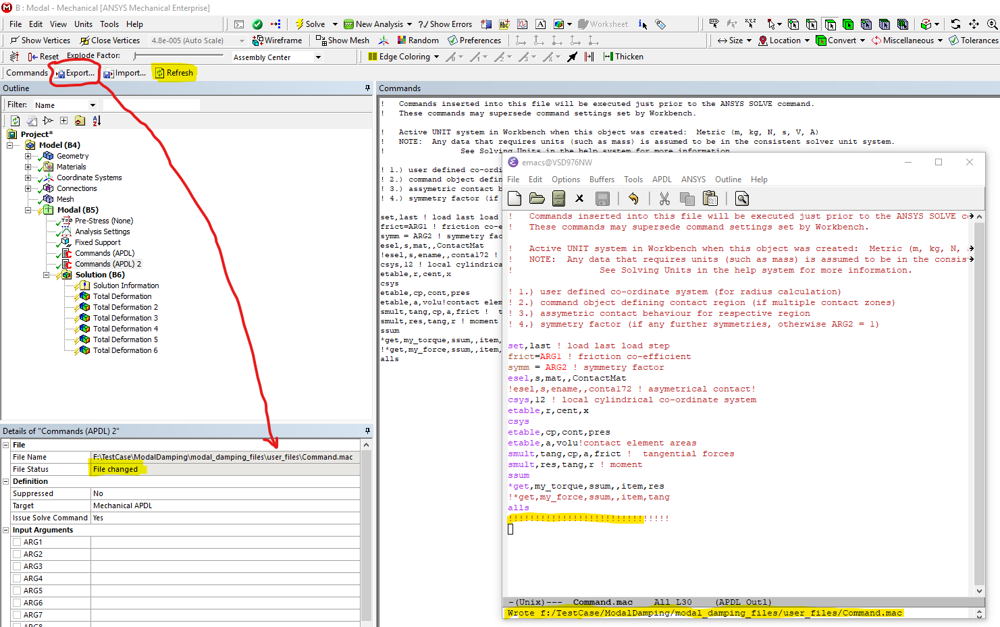
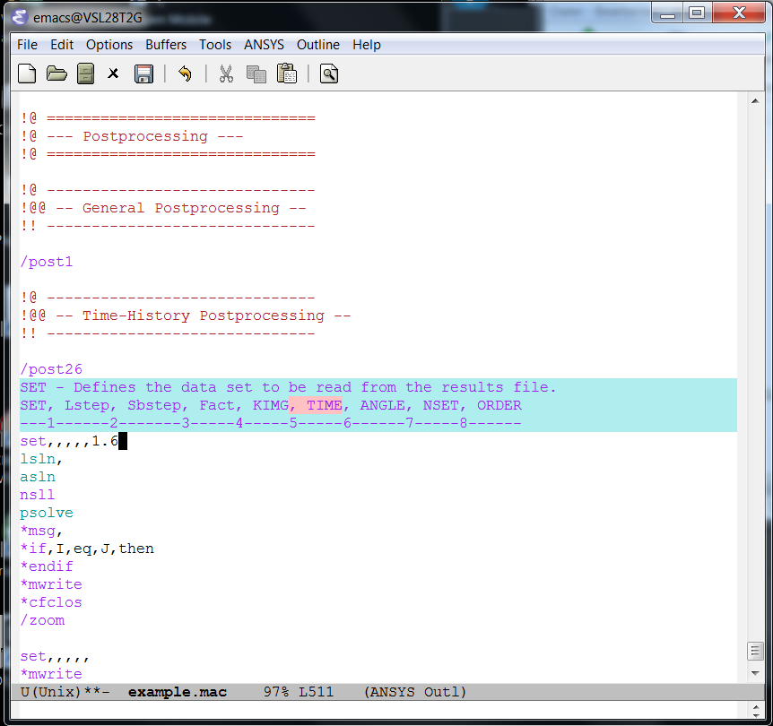
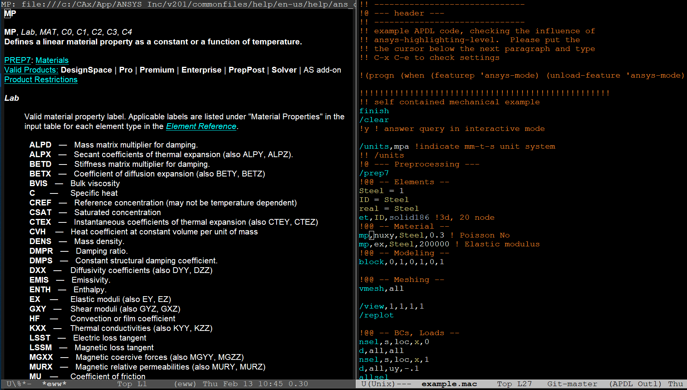
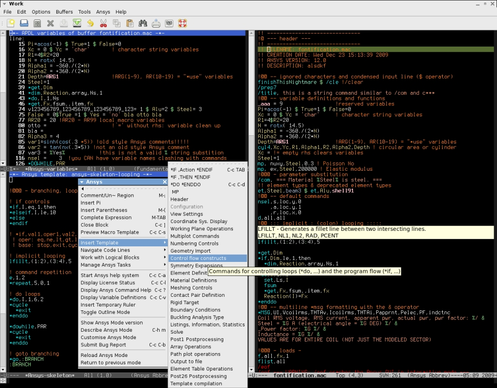
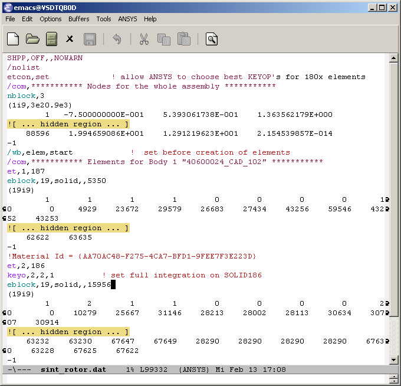
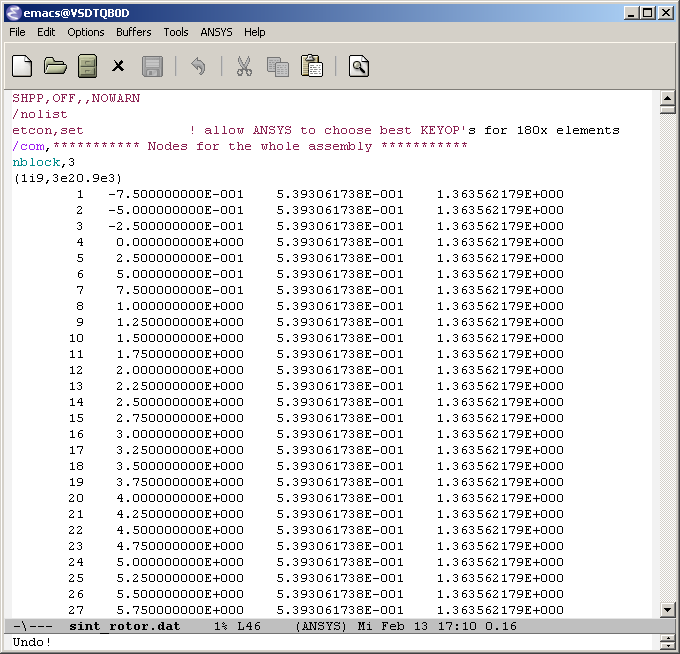

# Table of Contents

1.  [Introduction](#org668d1d6)
2.  [Some Highlights](#org061fdc3)
3.  [Installation](#orgb25cccc)
4.  [First Step](#orge012949)
5.  [Configuration and Customisation](#orga99af96)
6.  [Bugs and Problems](#orgec67437)
7.  [News](#orge156e01)
8.  [Further Resources](#orgdcccb2b)
9.  [Acknowledgements](#org8feeb66)
10. [Todos](#orgeac1d9b)
11. [GNU GPL v3 License](#org78bef04)

## The GNU-Emacs major mode for the scripting language APDL

APDL-Mode version 20.6.0

Copyright (C) 2006 - 2021  H. Dieter Wilhelm, GPL V3

# Introduction

APDL, [Ansys Parametric Design Language](https://de.wikipedia.org/wiki/ANSYS_Parametric_Design_Language) is the solver scripting
language of the mechanical FEA, Finite Element Analysis suite [Ansys](http://www.ansys.com),
ANalysis SYStem, registered TM.

APDL-Mode, is - in conjunction with the [GNU-Emacs](https://www.gnu.org/software/emacs/) editor - an advanced
APDL environment with features like, browsing the APDL reference
documentation, keyword completion and abbreviations, code templates
and code outlining / folding, dedicated highlighting, solver
communication (GNU-Linux only), license reporting, etc.  Please
convince yourself in the APDL-Mode in-depth documentation.

With the advent of the modern Ansys GUIs - like \`WorkBench' or
\`Discovery' - the usage of APDL as a wholesale modelling language has
waned for highly variable tasks which are expensive to script.  But,
nevertheless, APDL is here to stay: \`WorkBench' operates exclusively
the Ansys solver with it!  It assembles and sends APDL input (.dat)
files to the solver.  For a true understanding of the GUI's inner
workings a study of their APDL code is prerequisite!  Moreover,
WorkBench is not supporting all MAPDL solver features.  So "Command
(APDL)" objects are used to enhance the GUI's modelling capabilities.

APDL-Mode is equally useful for studying solver (.dat) files which
were created by WorkBench.  And, especially, for writing WorkBench
\`Command' objects and inspecting longer command snippets from other
sources.  Accessing the Ansys APDL reference documentation without
detour - this alone - is worth using APDL-Mode.

When you "Export" (or "Import") such a WorkBench "Command (APDL)"
object, it becomes associated with a file on disk and is accessible
for any kind of editor.  If you modify this file, the "File Status" in
Workbench changes and you can pull-in the updated content with the
"Refresh" button.

# Some Highlights

## In-built APDL command help with argument counter

Especially for commands with a large number of arguments it is
cumbersome to count the arguments, **M-?** facilitates this for you
and visualises dynamically at which parameter position your cursor
currently is.

## Pin-pointing the relevant Ansys documentation

You can browse (with **C-c C-b** on a code line) the relevant Ansys
manual entry directly without the detour of searching in the Ansys
online help.  This works not only for all APDL commands but also
for element names and more general manual topics!

Since Ansys v191 the online help is the default.  APDL-Mode is
using your default browser but to be able to access the online help
you must register or you must start the online help once from any
licensed Ansys product.  I recommend installing the local Ansys
documentation package, access time is much shorter.

The image below is showing a manual entry in GNU-Emacs' EWW
browser.  You are able to consult the manuals side-by-side your
APDL code.

## Command Object Templates and Code Highlighting Example

You are learning and also coding APDL best by example!  APDL-Mode
provides coding examples, here called templates, for the most often
used subjects.  Moreover you are able to compile your own WorkBench
/ Discovery AIM Command templates and have them all immediately
available in APDL-Mode for inspection and inclusion.

APDL-Mode is helping you with code colourisation to distinguish
valid commands, user variables, element names, comments, APDL
functions and further subjects.

Below image shows GNU-Emacs with a ripped off APDL-Mode menu, the
APDL variable buffer, the APDL file itself and an APDL template
preview.

## Code outlining for inspecting WorkBench solver (.dat) files

APDL-Mode hides the normally uninteresting but usually very large
number blocks.

The image below shows the unhidden content.

# Installation

Copyright (C) 2006 - 2021  H. Dieter Wilhelm, GPL V3

Please install the [GNU-Emacs](https://www.gnu.org/software/emacs/) Editor first, For all functionality
APDL-Mode needs version 25.1 (from 2016) or newer.  (If you are new
to this editor please check its tutorial in the \`Help' menu, or read
at least the APDL-Mode introduction.)

## Melpa

APDL-Mode is now available on the GNU-Emacs packages archive [Melpa](https://melpa.org/).

Please add

    (add-to-list 'package-archives
    	  '("melpa" . "https://melpa.org/packages/") t)

to your initialisation file.  Then type: \`M-x list-packages', find
\`apdl-mode', mark it with \`i' and install it with \`x'.

If you prefer the stable package archive instead of development
versions, exchange above package source with

    (add-to-list 'package-archives
    '("melpa-stable" . "https://stable.melpa.org/packages/") t)

## Manual installation

If you are behind a corporate firewall and you are not able to
install APDL-Mode from Emacs' package menu, you can download and
install APDL-Mode manually:

-   Download the latest APDL-Mode's tar package from [Melpa](https://melpa.org/#/apdl-mode) or - for a
    released package - from the [Github](https://github.com/dieter-wilhelm/apdl-mode/releases/tag/20.1.0) release page.
-   Install the package within Emacs: Please type \`M-x
    package-install-file <RET>' and select your downloaded tar file.

That's it.

**Hint:** If you are getting an error message "package.el is not yet
initialised", you are using Emacs' packaging system for the very
first time.  It is necessary to initialise this machinery once,
please type: \`M-: (package-initialize) <RET>' (it's an 'ALT + :'
colon!)  and then apply \`M-x package-install-file <RET>' again.

## Development and source code installation

Please clone the APDL-Mode git archive in a directory of your
choice:

    git clone https://github.com/dieter-wilhelm/apdl-mode.git

or download the GitHub ZIP archive and add the following line

    (require 'apdl-mode)

to your initialisation file (the source directory must be set in
the \`load-path' variable as well).

# First Step

Please type \`M-x apdl' which opens a buffer in APDL-Mode where you
can inspect the menu bar's \`APDL' and \`MAPDL' entries.  For existing
APDL files please type \`M-x apdl-mode' if the mode is not activated
already, please see in [5](#orga99af96),
the section regarding preconfigured file suffixes.

For further guidance please select the APDL menu \`APDL-Mode
Documentation' (or type \`C-c C-h') and \`Describe APDL-Mode' (or type
\`C-h m') for the list of its keybindings.  You might also check the
introductory APDL-Mode [tutorial](https://dieter-wilhelm.github.io/apdl-mode/doc/A-M_introductory_tutorial.pdf).

APDL-Mode was tested with Ansys v201 and v202 under Windows 10 for
Emacs-27 under GNU-Linux and Windows.

# Configuration and Customisation

Most functionality is working without additional configurations.
APDL-Mode is intelligent enough to figure out Ansys installation
dependent paths.  For regular Ansys installations, it chooses by
default the highest installed Ansys version on your system.

APDL-Mode configures GNU-Emacs to open all files with the suffixes
".mac", ".dat" and ".inp" under apdl-mode.

Please read the [apdl-config](info/apdl-config.md) documentation for further options or
open the accompanying configuration [example-file](apdl-config.el).

# Bugs and Problems

Feedback is always welcome.  If you have issues while installing and
running this mode or want to suggest improvements you have the
following options:

1.  Write an email to the [mode maintainer](mailto:dieter@duenenhof-wilhelm.de).  Please trigger a bug report
    form from the APDL-Mode menu or by calling the function
    \`apdl-submit-bug-report'.  Even if you have not configured Emacs to
    send emails, please copy the content of the mail template for the
    maintainer.

2.  You might issue bug reports or feature requests at APDL-Mode's
    [issues site](https://github.com/dieter-wilhelm/apdl-mode/issues)

3.  And you can leave comments and hints at the [APDL-Mode page](https://www.emacswiki.org/emacs/APDLMode) of the
    [Emacs Wiki](https://www.emacswiki.org).

# News

For further news please have a look into the [NEWS](info/NEWS.md) file.

# Further Resources

If you want to read further details regarding the APDL scripting,
GNU-Emacs and other APDL editors please read the [RESOURCES](info/resources.md) file.

# Acknowledgements

My acknowledgements to Tim Read and Geoff Foster for their
ansys-mod.el from 1997 which triggered the idea in 2006 to start
APDL-Mode.

Parts of APDL-Mode were based on octave-mod.el: Copyright (C) 1997
Free Software Foundation, Inc.  Authors: [Kurt Hornik](mailto:Kurt.Hornik@wu-wien.ac.at) and [John Eaton](mailto:jwe@bevo.che.wisc.edu).

I received, moreover, support and feedback from many individuals.
Thank you very much!

# Todos

Please check the [TODO](info/TODO.md) file.

# GNU GPL v3 License

The GNU General Public License version 3.  There are no costs and no
usage restrictions even in commercial application, please convince
yourself with the [LICENSE](info/LICENSE) file.

